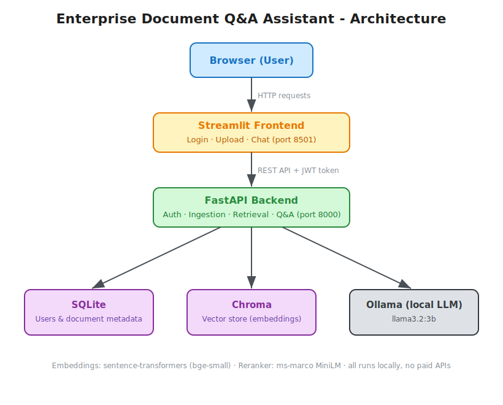
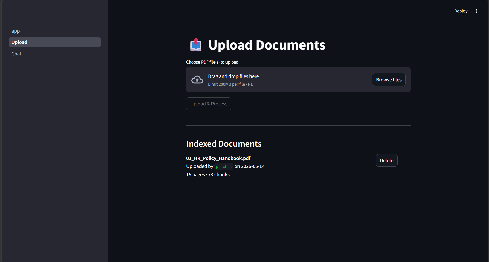
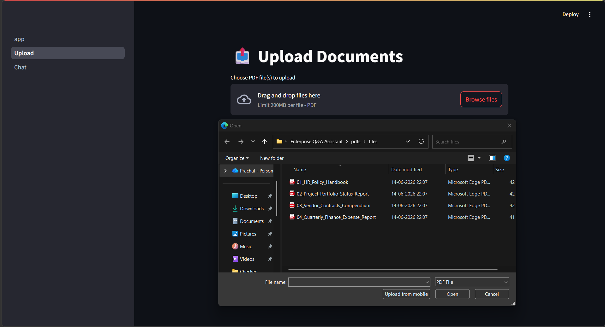
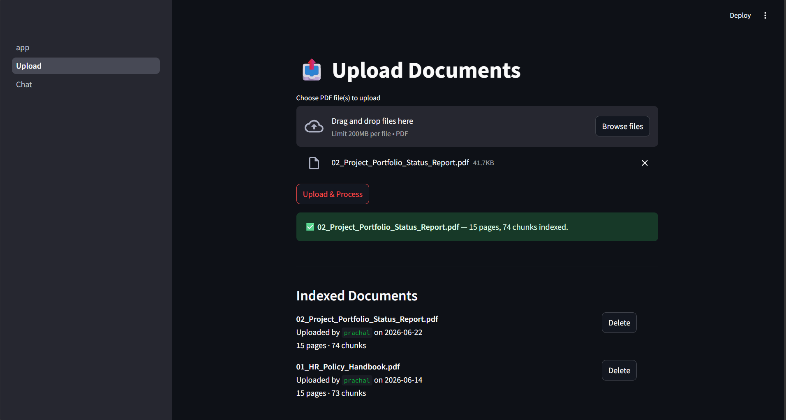
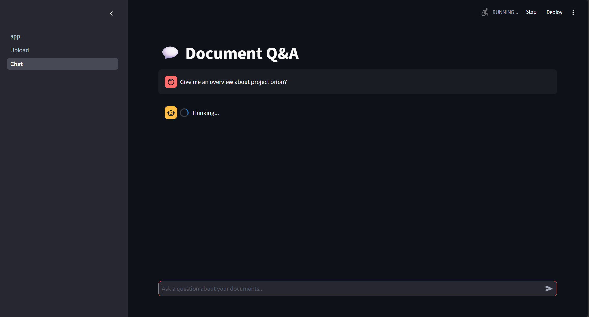
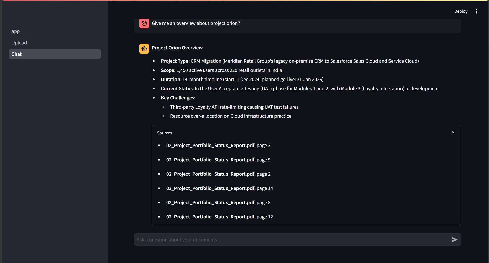
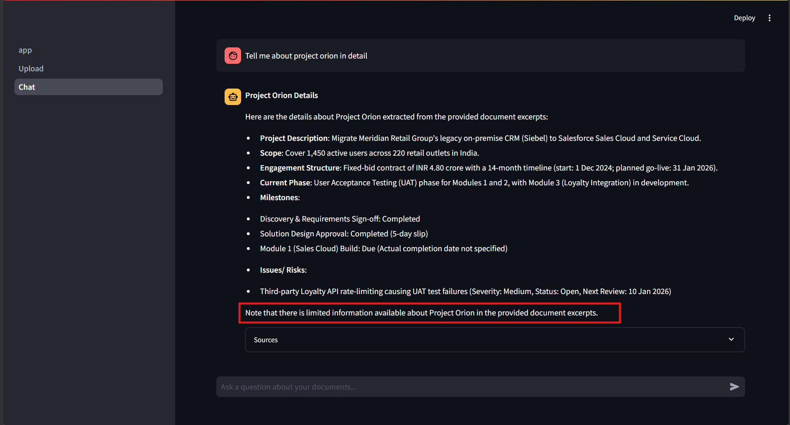
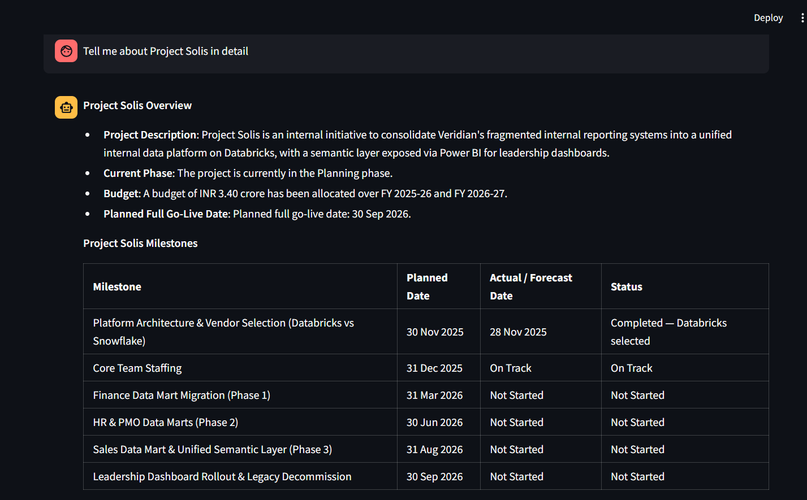
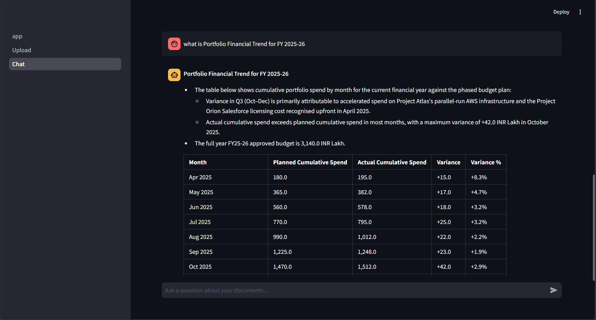

# Enterprise Document Q&A Assistant

So basically what this does is - you upload your company PDFs and then you can ask questions from them in plain English. It will give you the answer and also tell you exactly which file and which page it got that from.

We built this because our team was spending too much time searching inside long HR and policy documents manually. Now anyone can just ask "what is the leave policy" and get the answer in seconds.

No paid APIs, everything runs on your own machine.

## What it can do

- Upload PDFs and it will read the text as well as tables inside them
- Ask questions in a chat window
- Shows you the source - which file, which page number
- Each person has their own login
- Nothing goes to any outside server, all local only

## Architecture



The editable source of this diagram is in `architecture.excalidraw` (open it at [excalidraw.com](https://excalidraw.com) if you want to change it).

## Tech used

We tried a few things before settling on this. Here is what we are using and why:

- **Streamlit** for the frontend - honestly just because it is pure Python and our team does not know React or any of that
- **FastAPI** for the backend API - faster than Flask and the automatic docs are very helpful when debugging
- **pdfplumber** for reading PDFs - tried a few libraries, this one was most reliable especially for tables
- **sentence-transformers** (`BAAI/bge-small-en-v1.5`) for converting text to vectors - runs on CPU without any GPU needed
- **Chroma** for storing those vectors - saves to disk so you don't lose everything on restart
- **Ollama** with `llama3.2:3b` as the actual AI model - fully local, no API cost, works fine for this use case
- **SQLite + bcrypt + JWT** for login and user management - simple, no separate database server needed

## Before you start

You need these installed:

- Python 3.11 or above
- [Ollama](https://ollama.com) - download and install it, then run:

```
ollama pull llama3.2:3b
```

This will download the AI model, around 2GB so give it some time.

## How to run it

You need two terminals open at the same time.

**Terminal 1 - Backend:**

```bash
cd backend
python -m venv venv
venv\Scripts\activate
pip install -r requirements.txt
uvicorn main:app --host 0.0.0.0 --port 8000
```

**Terminal 2 - Frontend:**

```bash
cd frontend
python -m venv venv
venv\Scripts\activate
pip install -r requirements.txt
streamlit run app.py
```

Then open `http://localhost:8501` in browser.

Note - you only need to do `pip install` once. After that just activate the venv and run directly.

## Creating your first account

Go to the login page and click "Create Account". You will need an admin secret to register. Default is `changeme` - please change this before giving access to others.

To change it, set this before starting the backend:

```bash
set ADMIN_SECRET=putsomethingstrongerhere
```

## Changing the AI model

If you want to try a different model just pull it in Ollama and set the env variable:

```bash
ollama pull mistral:7b
set OLLAMA_MODEL=mistral:7b
```

Bigger models give better answers but are slower. We found `llama3.2:3b` to be good enough for document Q&A.

## Folder structure

```
Enterprise Q&A Assistant/
├── backend/
│   ├── main.py          # all the API endpoints are here
│   ├── auth.py          # login, token creation, password hashing
│   ├── ingestion.py     # reads the PDF and breaks it into pieces
│   ├── retrieval.py     # search logic using vectors
│   ├── qa.py            # sends question + context to Ollama and gets answer
│   ├── models.py        # database table definitions
│   └── requirements.txt
├── frontend/
│   ├── app.py           # login page
│   ├── pages/
│   │   ├── 1_Upload.py  # upload page
│   │   └── 2_Chat.py    # chat page
│   └── requirements.txt
├── data/
│   ├── uploads/         # the actual PDF files
│   ├── chroma_db/       # vector data, don't delete this
│   └── users_db/        # user accounts database
└── README.md
```

## How it works (roughly)

When you upload a PDF:
- It reads every page, pulls out text and any tables separately
- Splits everything into small chunks of around 800 characters
- Converts each chunk into a vector (basically a list of numbers representing meaning)
- Saves all these vectors in Chroma along with which file and page they came from

When you ask a question:
- Your question also gets converted to a vector
- Chroma finds the chunks whose vectors are closest to your question vector
- Those chunks get sent to Ollama along with your question
- Ollama reads those chunks and gives an answer, we then show you which pages it used

The reason we do vectors instead of simple keyword search is that keyword search would miss things. Like if document says "annual entitlement" and you ask "how many leaves do I get", keyword search finds nothing. Vector search understands they mean the same thing.

## Screenshots

### Uploading documents

| Upload page | Pick files | Processing done |
|---|---|---|
|  |  |  |

### Asking questions



| Answer with citation | Another answer |
|---|---|
|  |  |
|  |  |

More example questions and answers are in the [`Screenshots/`](Screenshots) folder.

## Known issues / things to improve later

- Very vague questions sometimes retrieve wrong chunks, try to be specific
- No rate limiting on the API yet
- Table extraction is not perfect for all PDF formats, works fine for most
- Currently all users share the same document knowledge base, no per-user separation
